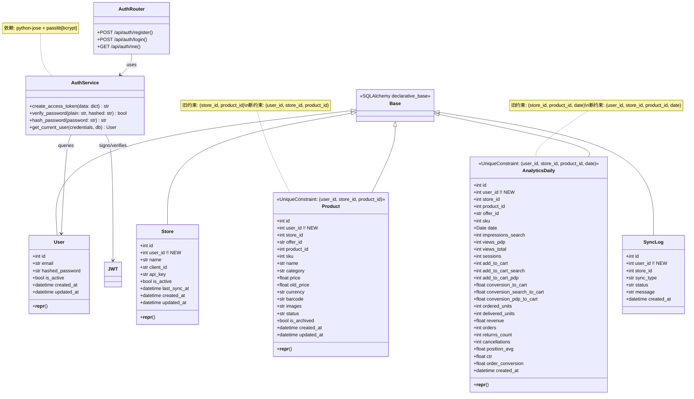
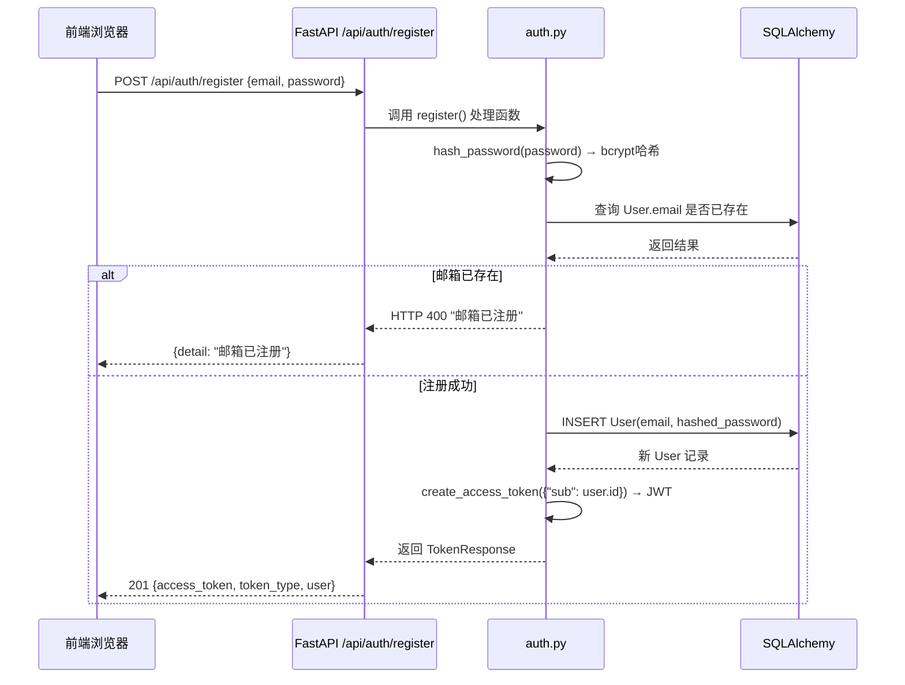
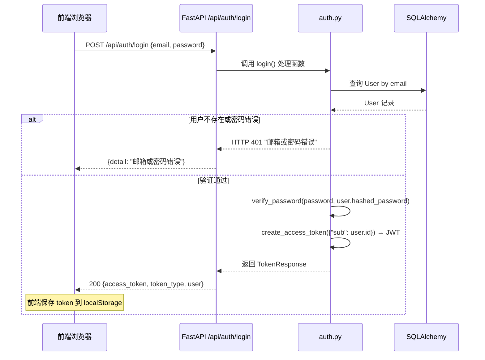
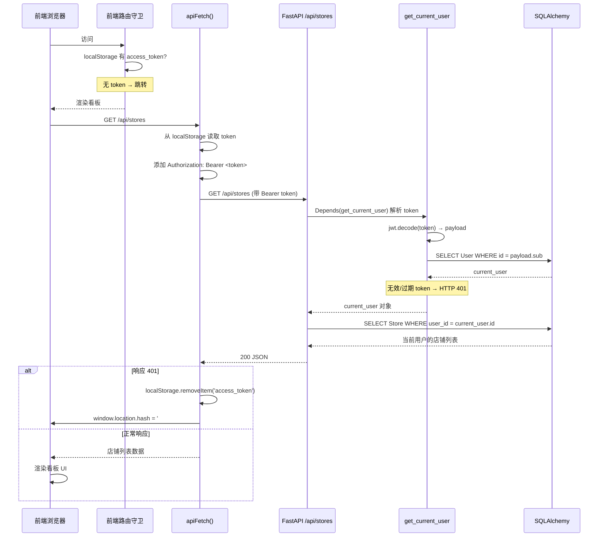
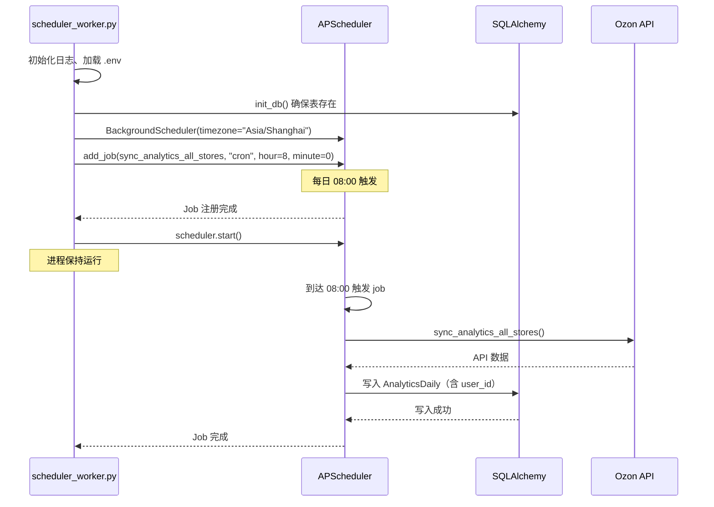
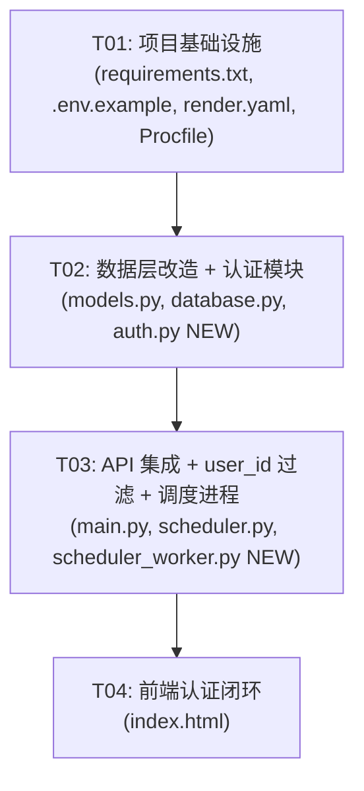

# Ozon Analytics SaaS 化改造 — 阶段一 架构设计文档

## 1. 实现方案 + 框架选型

### 核心技术挑战

| 挑战 | 方案 |
|------|------|
| 用户认证体系从零搭建 | FastAPI 自带 `HTTPBearer` + `python-jose` JWT 签发验证 |
| 密码安全存储 | `passlib[bcrypt]` 哈希，不存明文 |
| 已有 API 数据隔离 | 所有业务表加 `user_id` 列 + SQLAlchemy 查询过滤 |
| 前端无框架 SPA 多页面 | Hash 路由（`#login`/`#register`/`#dashboard`）+ 原生 JS 动态渲染 |
| 调度器与 Web 服务解耦 | `scheduler_worker.py` 独立进程，通过环境变量复用同一代码库 |

### 框架与库选择

| 类别 | 选型 | 理由 |
|------|------|------|
| Web 框架 | FastAPI (已有) | 不变，减少迁移风险 |
| ORM | SQLAlchemy 2.0 (已有) | 不变 |
| JWT | python-jose[cryptography]==3.3.0 | FastAPI 生态标准搭配 |
| 密码哈希 | passlib[bcrypt]==1.7.4 | 业界标准 bcrypt 算法 |
| 调度器 | APScheduler (已有) | 不变，仅拆为独立进程 |
| 前端 | 单文件 SPA (已有) | 保持无构建步骤 |

### 架构模式

- **后端**: 分层架构（路由层 → 服务层 → 数据访问层），新增 `auth.py` 作为认证模块
- **认证**: Bearer Token 模式，`Depends(get_current_user)` 注入到所有受保护路由
- **数据隔离**: 行级隔离 — 每个查询自动附加 `user_id = current_user.id` 过滤条件
- **进程模型**: Web 进程（FastAPI）+ Worker 进程（APScheduler），共享同一代码库和数据库

---

## 2. 文件列表

### 新增文件

```
backend/auth.py                          — 认证模块：JWT 签发/验证、密码哈希、注册/登录路由、get_current_user 依赖
backend/scheduler_worker.py              — APScheduler 独立进程入口（由 worker 服务启动）
```

### 修改文件

```
backend/models.py                        — 新增 User 模型 + 四张业务表加 user_id 列 + 更新唯一约束
backend/database.py                      — init_db() 导入 User 和 SyncLog 模型
backend/main.py                          — 注册 auth 路由、所有 API 端点加 get_current_user 依赖 + user_id 过滤
backend/scheduler.py                     — 同步函数获取 store.user_id 并写入业务表
backend/requirements.txt                 — 新增 python-jose, passlib
.env.example                             — 新增 OZON_JWT_SECRET 环境变量说明
render.yaml                              — 新增 worker 服务 + OZON_JWT_SECRET 环境变量
Procfile                                 — 新增 worker 进程入口
frontend/index.html                      — 新增登录/注册页面 UI、hash 路由、apiFetch 封装、路由守卫
```

---

## 3. 数据结构和接口（类图）



### Pydantic 请求/响应模型（新增）

```python
class RegisterRequest(BaseModel):
    email: str = Field(..., pattern=r"^[a-zA-Z0-9_.+-]+@[a-zA-Z0-9-]+\.[a-zA-Z0-9-.]+$")
    password: str = Field(..., min_length=6, max_length=128)

class LoginRequest(BaseModel):
    email: str
    password: str

class TokenResponse(BaseModel):
    access_token: str
    token_type: str = "bearer"
    user: dict  # {id, email}

class UserMeResponse(BaseModel):
    id: int
    email: str
    is_active: bool
    created_at: datetime
```

---

## 4. 程序调用流程（时序图）

### 4.1 用户注册流程



### 4.2 用户登录 + JWT 签发流程



### 4.3 已登录用户访问店铺列表（含中间件鉴权）



### 4.4 APScheduler 独立进程启动流程



---

## 5. 任务列表（按依赖顺序）

### T01: 项目基础设施（依赖配置 + 依赖声明）

| 字段 | 值 |
|------|-----|
| **编号** | T01 |
| **名称** | 项目基础设施 — 依赖包 + 环境变量 + 部署配置 |
| **优先级** | P0 |
| **前置依赖** | 无 |

**涉及文件：**
| 操作 | 文件 | 变更说明 |
|------|------|----------|
| 修改 | `backend/requirements.txt` | 追加 `python-jose[cryptography]==3.3.0` 和 `passlib[bcrypt]==1.7.4` |
| 修改 | `.env.example` | 新增 `OZON_JWT_SECRET=` 环境变量说明 |
| 修改 | `render.yaml` | 新增 worker 服务（scheduler_worker）+ 双服务均加 `OZON_JWT_SECRET` 变量 |
| 修改 | `Procfile` | 追加 `worker: python backend/scheduler_worker.py` |

**详细变更说明：**

**backend/requirements.txt** — 在文件末尾追加两行：
```
python-jose[cryptography]==3.3.0
passlib[bcrypt]==1.7.4
```

**.env.example** — 在 `OZON_ENCRYPTION_KEY` 之后追加：
```ini
# JWT 密钥（生产环境必须设置，否则自动生成临时密钥）
# 生成方法: python -c "import secrets; print(secrets.token_hex(32))"
OZON_JWT_SECRET=
```

**render.yaml** — 在 `services` 下新增 worker 服务：
```yaml
  - type: worker
    name: ozon-analytics-worker
    env: python
    buildCommand: pip install -r backend/requirements.txt
    startCommand: python backend/scheduler_worker.py
    envVars:
      - key: DATABASE_URL
        fromDatabase:
          name: ozon-analytics-db
          property: connectionString
      - key: OZON_ENCRYPTION_KEY
        sync: false
      - key: OZON_JWT_SECRET
        sync: false
      - key: PYTHON_VERSION
        value: "3.13.2"
```

同时 web 服务的 `envVars` 中新增 `OZON_JWT_SECRET`（sync: false）。

**Procfile** — 追加：
```
worker: python backend/scheduler_worker.py
```

---

### T02: 后端数据层改造 — User 模型 + user_id 字段 + 备份模块

| 字段 | 值 |
|------|-----|
| **编号** | T02 |
| **名称** | 后端数据层改造 — User 模型 + 四表加 user_id + auth 核心模块 |
| **优先级** | P0 |
| **前置依赖** | T01 |

**涉及文件：**
| 操作 | 文件 | 变更说明 |
|------|------|----------|
| 修改 | `backend/models.py` | 新增 User 模型 + 四张业务表加 `user_id` 列 + 更新唯一约束 |
| 修改 | `backend/database.py` | `init_db()` 导入 User 和 SyncLog 模型 |
| 新增 | `backend/auth.py` | JWT 签发/验证、密码哈希、注册/登录路由、`get_current_user` 依赖 |

**详细变更说明：**

**backend/models.py — User 模型（新增，放在 Store 之前）：**
```python
class User(Base):
    """系统用户"""
    __tablename__ = "users"

    id = Column(Integer, primary_key=True, autoincrement=True)
    email = Column(String(255), unique=True, nullable=False, index=True, comment="邮箱")
    hashed_password = Column(String(255), nullable=False, comment="bcrypt 密码哈希")
    is_active = Column(Boolean, default=True, comment="用户是否激活")
    created_at = Column(DateTime, server_default=func.now())
    updated_at = Column(DateTime, server_default=func.now(), onupdate=func.now())

    def __repr__(self):
        return f"<User {self.email}>"
```

**backend/models.py — Store 表新增 user_id：**
```python
class Store(Base):
    __tablename__ = "stores"
    id = Column(Integer, primary_key=True, autoincrement=True)
    user_id = Column(Integer, nullable=False, comment="所属用户ID")   # 新增
    # ... 其余字段不变
```

**backend/models.py — Product 表新增 user_id + 更新约束：**
```python
class Product(Base):
    __tablename__ = "products"

    id = Column(Integer, primary_key=True, autoincrement=True)
    user_id = Column(Integer, nullable=False, comment="所属用户ID")   # 新增
    store_id = Column(Integer, nullable=False, comment="所属店铺ID")
    # ... 其余字段不变

    __table_args__ = (
        UniqueConstraint("user_id", "store_id", "product_id", name="uq_user_store_product"),  # 更新
        Index("idx_user_store_product", "user_id", "store_id", "product_id"),                 # 更新
    )
```

**backend/models.py — AnalyticsDaily 表新增 user_id + 更新约束：**
```python
class AnalyticsDaily(Base):
    __tablename__ = "analytics_daily"

    id = Column(Integer, primary_key=True, autoincrement=True)
    user_id = Column(Integer, nullable=False, comment="所属用户ID")   # 新增
    store_id = Column(Integer, nullable=False, comment="店铺ID")
    # ... 其余字段不变

    __table_args__ = (
        UniqueConstraint("user_id", "store_id", "product_id", "date", name="uq_user_analytics_daily"),  # 更新
        Index("idx_analytics_daily_date", "date"),
        Index("idx_user_analytics_store_product", "user_id", "store_id", "product_id"),               # 更新
    )
```

**backend/models.py — SyncLog 表新增 user_id：**
```python
class SyncLog(Base):
    __tablename__ = "sync_logs"

    id = Column(Integer, primary_key=True, autoincrement=True)
    user_id = Column(Integer, nullable=False, comment="所属用户ID")   # 新增
    store_id = Column(Integer, nullable=False)
    # ... 其余字段不变
```

**backend/database.py — 更新 init_db：**
```python
def init_db():
    from models import Store, Product, AnalyticsDaily, SyncLog, User  # noqa: F401  # 新增 SyncLog, User
    Base.metadata.create_all(bind=engine)
```

**backend/auth.py — 完整新文件内容：**
```python
"""用户认证模块：JWT 签发/验证、密码哈希、注册/登录 API、get_current_user 依赖"""
import os
import logging
from datetime import datetime, timedelta, timezone
from typing import Optional

from dotenv import load_dotenv
_load_path = os.path.join(os.path.dirname(os.path.dirname(os.path.abspath(__file__))), ".env")
load_dotenv(_load_path, override=False)

from fastapi import APIRouter, Depends, HTTPException, status
from fastapi.security import HTTPBearer, HTTPAuthorizationCredentials
from jose import JWTError, jwt
from passlib.context import CryptContext
from pydantic import BaseModel, Field, EmailStr
from sqlalchemy.orm import Session

from database import get_db
from models import User

logger = logging.getLogger(__name__)

# ==================== 配置 ====================

# JWT 密钥：从环境变量读取，不设则自动生成（仅开发模式）
_SECRET_KEY = os.environ.get("OZON_JWT_SECRET")
if not _SECRET_KEY:
    import secrets
    _SECRET_KEY = secrets.token_hex(32)
    logger.warning("Auto-generated JWT secret (dev mode). Set OZON_JWT_SECRET env var for production!")

ALGORITHM = "HS256"
ACCESS_TOKEN_EXPIRE_MINUTES = 60 * 24  # 24 小时

# 密码哈希上下文
pwd_context = CryptContext(schemes=["bcrypt"], deprecated="auto")

# API 路由
router = APIRouter(prefix="/api/auth", tags=["auth"])
security = HTTPBearer(auto_error=False)  # auto_error=False 允许未认证时返回 None


# ==================== Pydantic 模型 ====================

class RegisterRequest(BaseModel):
    email: str = Field(..., pattern=r"^[a-zA-Z0-9_.+-]+@[a-zA-Z0-9-]+\.[a-zA-Z0-9-.]+$")
    password: str = Field(..., min_length=6, max_length=128)

class LoginRequest(BaseModel):
    email: str
    password: str

class TokenResponse(BaseModel):
    access_token: str
    token_type: str = "bearer"
    user: dict

class UserMeResponse(BaseModel):
    id: int
    email: str
    is_active: bool
    created_at: datetime

    model_config = {"from_attributes": True}


# ==================== 工具函数 ====================

def hash_password(password: str) -> str:
    """使用 bcrypt 哈希密码"""
    return pwd_context.hash(password)


def verify_password(plain_password: str, hashed_password: str) -> bool:
    """验证密码与哈希是否匹配"""
    return pwd_context.verify(plain_password, hashed_password)


def create_access_token(data: dict, expires_delta: Optional[timedelta] = None) -> str:
    """创建 JWT access token"""
    to_encode = data.copy()
    expire = datetime.now(timezone.utc) + (expires_delta or timedelta(minutes=ACCESS_TOKEN_EXPIRE_MINUTES))
    to_encode.update({"exp": expire})
    return jwt.encode(to_encode, _SECRET_KEY, algorithm=ALGORITHM)


async def get_current_user(
    credentials: Optional[HTTPAuthorizationCredentials] = Depends(security),
    db: Session = Depends(get_db),
) -> User:
    """获取当前认证用户（依赖注入）"""
    if credentials is None:
        raise HTTPException(
            status_code=status.HTTP_401_UNAUTHORIZED,
            detail="未提供认证凭据",
            headers={"WWW-Authenticate": "Bearer"},
        )
    token = credentials.credentials
    try:
        payload = jwt.decode(token, _SECRET_KEY, algorithms=[ALGORITHM])
        user_id: int = payload.get("sub")
        if user_id is None:
            raise HTTPException(status_code=401, detail="无效的 Token")
    except JWTError:
        raise HTTPException(status_code=401, detail="无效的 Token")

    user = db.query(User).filter_by(id=user_id, is_active=True).first()
    if user is None:
        raise HTTPException(status_code=401, detail="用户不存在或已禁用")
    return user


# ==================== API 路由 ====================

@router.post("/register", status_code=201)
def register(data: RegisterRequest, db: Session = Depends(get_db)):
    """用户注册"""
    # 检查邮箱是否已注册
    existing = db.query(User).filter_by(email=data.email).first()
    if existing:
        raise HTTPException(status_code=400, detail="该邮箱已注册")

    # 创建用户
    user = User(
        email=data.email,
        hashed_password=hash_password(data.password),
    )
    db.add(user)
    db.commit()
    db.refresh(user)

    # 签发 token
    access_token = create_access_token({"sub": user.id})

    return TokenResponse(
        access_token=access_token,
        user={"id": user.id, "email": user.email},
    )


@router.post("/login")
def login(data: LoginRequest, db: Session = Depends(get_db)):
    """用户登录"""
    user = db.query(User).filter_by(email=data.email).first()
    if not user or not verify_password(data.password, user.hashed_password):
        raise HTTPException(status_code=401, detail="邮箱或密码错误")

    if not user.is_active:
        raise HTTPException(status_code=403, detail="用户已被禁用")

    access_token = create_access_token({"sub": user.id})

    return TokenResponse(
        access_token=access_token,
        user={"id": user.id, "email": user.email},
    )


@router.get("/me", response_model=UserMeResponse)
def get_me(current_user: User = Depends(get_current_user)):
    """获取当前用户信息"""
    return current_user
```

---

### T03: API 集成 + user_id 过滤 + 调度进程分离

| 字段 | 值 |
|------|-----|
| **编号** | T03 |
| **名称** | API 集成认证中间件 + 所有端点 user_id 过滤 + 调度器进程分离 |
| **优先级** | P0 |
| **前置依赖** | T02 |

**涉及文件：**
| 操作 | 文件 | 变更说明 |
|------|------|----------|
| 修改 | `backend/main.py` | 注册 auth 路由、所有 API 端点加 `Depends(get_current_user)` + `user_id` 过滤 |
| 修改 | `backend/scheduler.py` | 同步函数从 Store 获取 `user_id` 并写入业务表 |
| 新增 | `backend/scheduler_worker.py` | APScheduler 独立进程入口 |

**详细变更说明：**

**backend/main.py 变更点：**

1. **导入新增** — 文件顶部新增：
```python
from auth import router as auth_router, get_current_user
from models import User  # 补充导入
```

2. **注册 auth 路由** — 在 `app = FastAPI(...)` 后、CORS 中间件前或后：
```python
app.include_router(auth_router)
```

3. **移除内联 APScheduler** — 从 `lifespan` 中移除 `BackgroundScheduler` 相关代码（因为调度器已独立为 worker 进程），保留 `init_db()` 调用：
```python
@asynccontextmanager
async def lifespan(app: FastAPI):
    """应用生命周期：启动时初始化DB，不再内嵌调度器"""
    init_db()
    yield
```

4. **所有 API 端点加 `get_current_user` 依赖 + user_id 过滤**：

| 端点 | 当前过滤器 | 改为 |
|------|-----------|------|
| `GET /api/stores` | 无过滤 | `.filter_by(user_id=current_user.id)` |
| `POST /api/stores` | 无过滤 | `Store(user_id=current_user.id, ...)` + 创建后自动关联当前用户 |
| `PUT /api/stores/{id}` | `filter_by(id=store_id)` | `.filter_by(id=store_id, user_id=current_user.id)` |
| `DELETE /api/stores/{id}` | `filter_by(id=store_id)` | `.filter_by(id=store_id, user_id=current_user.id)` |
| `GET /api/products` | `filter_by(store_id=store_id)` | `.filter_by(store_id=store_id, user_id=current_user.id)` |
| `GET /api/products/{pid}` | `filter_by(store_id=store_id, product_id=pid)` | `.filter_by(store_id=store_id, product_id=pid, user_id=current_user.id)` |
| `GET /api/analytics` | `filter(AnalyticsDaily.store_id == store_id, ...)` | `.filter(AnalyticsDaily.store_id == store_id, AnalyticsDaily.user_id == current_user.id, ...)` |
| `GET /api/analytics/summary` | 同上 | 同上加 user_id 过滤 |
| `POST /api/sync/{sync_type}` | `filter_by(id=data.store_id)` | `.filter_by(id=data.store_id, user_id=current_user.id)` |
| `GET /api/sync/logs` | `filter_by(store_id=store_id)` | `.filter_by(store_id=store_id, user_id=current_user.id)` |
| `GET /api/export/csv` | `filter(AnalyticsDaily.store_id == store_id, ...)` | `.filter(AnalyticsDaily.store_id == store_id, AnalyticsDaily.user_id == current_user.id, ...)` |

此外，`GET /api/stores` 返回的 `StoreOut` 中 `client_id` 展示保持不变（仅截断）。`POST /api/stores` 创建时需设置 `user_id=current_user.id`。

示例——`list_stores` 修改后：
```python
@app.get("/api/stores", response_model=List[StoreOut])
def list_stores(
    db: Session = Depends(get_db),
    current_user: User = Depends(get_current_user),
):
    """获取当前用户的所有店铺列表"""
    stores = db.query(Store).filter_by(user_id=current_user.id).all()
    # ... 其余不变
```

**backend/scheduler.py 变更点：**

1. **sync_products_for_store** — 在创建 `Product` 对象时，从 store 获取 user_id：
```python
# 在 Product 创建处（existing 不存在分支）
db.add(Product(
    user_id=store.user_id,      # 新增
    store_id=store_id,
    ...
))
# 已有记录不需要更新 user_id（因为 store 的 user_id 不变）
```

2. **sync_analytics_for_store** — 在创建 `AnalyticsDaily` 对象时，从 store 获取 user_id：
```python
data = {
    "user_id": store.user_id,   # 新增
    "store_id": store_id,
    ...
}
```

3. **sync_all_stores / sync_analytics_all_stores** — 无需变更（它们已通过 store 关联获取 user_id）

**backend/scheduler_worker.py — 完整新文件：**
```python
"""APScheduler 独立进程入口

由 Render worker 服务启动，与 Web 服务共享同一代码库和数据库。
负责每日定时数据同步任务。

启动方式:
    python backend/scheduler_worker.py
"""
import os
import sys
import logging

# 确保 backend 目录在 Python 路径中
_backend_dir = os.path.dirname(os.path.abspath(__file__))
if _backend_dir not in sys.path:
    sys.path.insert(0, _backend_dir)

# 加载 .env 环境变量
from dotenv import load_dotenv
_load_path = os.path.join(os.path.dirname(_backend_dir), ".env")
load_dotenv(_load_path, override=False)

from apscheduler.schedulers.background import BackgroundScheduler
from database import init_db
from scheduler import sync_analytics_all_stores

logging.basicConfig(
    level=logging.INFO,
    format="%(asctime)s [%(levelname)s] %(name)s: %(message)s",
)
logger = logging.getLogger("scheduler_worker")


def main():
    logger.info("Scheduler worker starting...")

    # 确保数据库表已创建
    init_db()
    logger.info("Database initialized.")

    # 创建调度器
    scheduler = BackgroundScheduler(timezone="Asia/Shanghai")
    scheduler.add_job(
        sync_analytics_all_stores,
        "cron",
        hour=8,
        minute=0,
        id="daily_analytics_sync",
        replace_existing=True,
    )
    logger.info("Scheduler configured: daily analytics sync at 08:00 Asia/Shanghai")

    scheduler.start()
    logger.info("Scheduler worker started successfully. Running forever...")

    try:
        # 保持进程运行
        import time
        while True:
            time.sleep(60)
    except (KeyboardInterrupt, SystemExit):
        logger.info("Scheduler worker shutting down...")
        scheduler.shutdown(wait=False)
        logger.info("Scheduler worker stopped.")


if __name__ == "__main__":
    main()
```

---

### T04: 前端认证闭环 — 登录/注册页面 + 路由 + apiFetch + 守卫

| 字段 | 值 |
|------|-----|
| **编号** | T04 |
| **名称** | 前端认证闭环 — 登录/注册 UI + Hash 路由 + apiFetch 封装 + 路由守卫 |
| **优先级** | P0 |
| **前置依赖** | T03 |

**涉及文件：**
| 操作 | 文件 | 变更说明 |
|------|------|----------|
| 修改 | `frontend/index.html` | 新增登录/注册页面 UI、hash 路由、apiFetch、路由守卫、logout |

**详细变更说明：**

**frontend/index.html 变更方案：**

整体架构：现有看板内容包裹在 `<div id="dashboard-page">` 中，新增 `<div id="login-page">` 和 `<div id="register-page">`，通过 JS 控制显示/隐藏。

**新增 CSS（在已有 `</style>` 前插入）：**
```css
/* ========== Auth Pages ========== */
.auth-page { display: none; min-height: 100vh; }
.auth-page.active { display: flex; justify-content: center; align-items: center; background: linear-gradient(135deg, #1e3a5f 0%, #2d5a8e 100%); }
.auth-card { background: #fff; border-radius: 16px; padding: 40px; width: 400px; max-width: 90vw; box-shadow: 0 20px 60px rgba(0,0,0,0.2); }
.auth-card h2 { font-size: 24px; margin-bottom: 8px; color: var(--text); text-align: center; }
.auth-card .auth-subtitle { font-size: 14px; color: var(--text-muted); text-align: center; margin-bottom: 28px; }
.auth-card .form-group { margin-bottom: 18px; }
.auth-card .form-group label { display: block; font-size: 13px; color: var(--text-secondary); margin-bottom: 6px; font-weight: 500; }
.auth-card .form-group input { width: 100%; padding: 10px 14px; border: 1px solid var(--border); border-radius: 8px; font-size: 15px; outline: none; transition: border-color 0.15s; box-sizing: border-box; }
.auth-card .form-group input:focus { border-color: var(--primary); box-shadow: 0 0 0 3px rgba(59,130,246,0.1); }
.auth-card .btn-block { width: 100%; padding: 11px; font-size: 15px; font-weight: 600; border-radius: 8px; }
.auth-card .auth-link { text-align: center; margin-top: 18px; font-size: 13px; color: var(--text-secondary); }
.auth-card .auth-link a { color: var(--primary); text-decoration: none; cursor: pointer; }
.auth-card .auth-link a:hover { text-decoration: underline; }
.auth-card .auth-error { background: var(--danger-light); color: #991b1b; font-size: 13px; padding: 10px 14px; border-radius: 8px; margin-bottom: 16px; display: none; }
.auth-card .auth-error.show { display: block; }
```

**新增 HTML 结构（在 `<body>` 开头，`.header` 之前）：**
```html
<!-- Login Page -->
<div class="auth-page" id="login-page">
    <div class="auth-card">
        <h2>Ozon Analytics</h2>
        <div class="auth-subtitle">登录到数据分析系统</div>
        <div class="auth-error" id="loginError"></div>
        <div class="form-group">
            <label>邮箱</label>
            <input type="email" id="loginEmail" placeholder="your@email.com" autocomplete="email">
        </div>
        <div class="form-group">
            <label>密码</label>
            <input type="password" id="loginPassword" placeholder="请输入密码" autocomplete="current-password">
        </div>
        <button class="btn btn-primary btn-block" onclick="handleLogin()">登 录</button>
        <div class="auth-link">
            还没有账号？<a onclick="navigateTo('#register')">立即注册</a>
        </div>
    </div>
</div>

<!-- Register Page -->
<div class="auth-page" id="register-page">
    <div class="auth-card">
        <h2>创建账号</h2>
        <div class="auth-subtitle">注册 Ozon Analytics 账户</div>
        <div class="auth-error" id="registerError"></div>
        <div class="form-group">
            <label>邮箱</label>
            <input type="email" id="registerEmail" placeholder="your@email.com" autocomplete="email">
        </div>
        <div class="form-group">
            <label>密码</label>
            <input type="password" id="registerPassword" placeholder="至少 6 位密码" autocomplete="new-password">
        </div>
        <button class="btn btn-primary btn-block" onclick="handleRegister()">注 册</button>
        <div class="auth-link">
            已有账号？<a onclick="navigateTo('#login')">去登录</a>
        </div>
    </div>
</div>

<!-- Dashboard Page (existing content wrapper) -->
<div id="dashboard-page">
    <!-- 现有的 .header + .container 内容保持不变 -->
    ...
</div>
```

**现有看板内容包裹** — 将现有的 `.header` 和 `.container` 用 `<div id="dashboard-page">` 包裹。

上方的"现有的 .header + .container 内容保持不变"意味着所有现有 HTML 结构不动，只是外面包一层 `#dashboard-page` div。

**新增 JS（在 `init()` 函数之前或之后插入）：**

```javascript
// ==================== Auth & Routing ====================

function navigateTo(hash) {
    window.location.hash = hash;
}

function routePage() {
    const hash = window.location.hash || '#login';
    const token = localStorage.getItem('access_token');

    // 隐藏所有页面
    document.getElementById('login-page').classList.remove('active');
    document.getElementById('register-page').classList.remove('active');
    document.getElementById('dashboard-page').style.display = 'none';

    if (hash === '#login') {
        document.getElementById('login-page').classList.add('active');
    } else if (hash === '#register') {
        document.getElementById('register-page').classList.add('active');
    } else if (hash === '#dashboard') {
        if (!token) {
            window.location.hash = '#login';
            return;
        }
        document.getElementById('dashboard-page').style.display = 'block';
        // 触发看板初始化
        if (typeof initDashboard === 'function') initDashboard();
    }
}

// 封装 apiFetch：统一携带 JWT、处理 401
async function apiFetch(url, options = {}) {
    const token = localStorage.getItem('access_token');
    const headers = { ...options.headers };
    if (token) {
        headers['Authorization'] = `Bearer ${token}`;
    }
    headers['Content-Type'] = headers['Content-Type'] || 'application/json';

    try {
        const resp = await fetch(url, { ...options, headers });
        if (resp.status === 401) {
            localStorage.removeItem('access_token');
            window.location.hash = '#login';
            throw new Error('登录已过期，请重新登录');
        }
        return resp;
    } catch (e) {
        if (e.message === '登录已过期，请重新登录') throw e;
        throw e;
    }
}

// 登录处理
async function handleLogin() {
    const email = document.getElementById('loginEmail').value.trim();
    const password = document.getElementById('loginPassword').value;
    const errorEl = document.getElementById('loginError');

    errorEl.classList.remove('show');
    if (!email || !password) {
        errorEl.textContent = '请填写邮箱和密码';
        errorEl.classList.add('show');
        return;
    }

    try {
        const resp = await fetch('/api/auth/login', {
            method: 'POST',
            headers: { 'Content-Type': 'application/json' },
            body: JSON.stringify({ email, password }),
        });
        const data = await resp.json();
        if (!resp.ok) {
            errorEl.textContent = data.detail || '登录失败';
            errorEl.classList.add('show');
            return;
        }
        localStorage.setItem('access_token', data.access_token);
        window.location.hash = '#dashboard';
    } catch (e) {
        errorEl.textContent = '网络错误，请检查后端是否运行';
        errorEl.classList.add('show');
    }
}

// 注册处理
async function handleRegister() {
    const email = document.getElementById('registerEmail').value.trim();
    const password = document.getElementById('registerPassword').value;
    const errorEl = document.getElementById('registerError');

    errorEl.classList.remove('show');
    if (!email || !password) {
        errorEl.textContent = '请填写邮箱和密码';
        errorEl.classList.add('show');
        return;
    }
    if (password.length < 6) {
        errorEl.textContent = '密码至少 6 位';
        errorEl.classList.add('show');
        return;
    }

    try {
        const resp = await fetch('/api/auth/register', {
            method: 'POST',
            headers: { 'Content-Type': 'application/json' },
            body: JSON.stringify({ email, password }),
        });
        const data = await resp.json();
        if (!resp.ok) {
            errorEl.textContent = data.detail || '注册失败';
            errorEl.classList.add('show');
            return;
        }
        localStorage.setItem('access_token', data.access_token);
        window.location.hash = '#dashboard';
    } catch (e) {
        errorEl.textContent = '网络错误，请检查后端是否运行';
        errorEl.classList.add('show');
    }
}

// 退出登录
function handleLogout() {
    localStorage.removeItem('access_token');
    window.location.hash = '#login';
}

// 将现有 fetch 调用替换为 apiFetch
// 注意：所有 fetch(...) 调用改为 apiFetch(...)
```

**替换现有 fetch 调用：**
- `fetch(API + '/api/stores')` → `apiFetch(API + '/api/stores')`
- `fetch(API + '/api/products?...')` → `apiFetch(...)`
- `fetch(API + '/api/analytics?...')` → `apiFetch(...)`
- `fetch(API + '/api/analytics/summary?...')` → `apiFetch(...)`
- `fetch(API + '/api/sync/...')` → `apiFetch(...)`
- `fetch(API + '/api/sync/logs?...')` → `apiFetch(...)`
- `fetch(API + '/api/export/csv?...')` → 下载类请求也改为 apiFetch（或保留直接跳转）

**Header 增加退出按钮：**
在 `.header-actions` 中（最左侧或最右侧）新增：
```html
<button class="btn btn-outline" onclick="handleLogout()">退出登录</button>
```

**修改 init 函数：**
```javascript
// ==================== Init ====================
function init() {
    // 监听 hash 变化
    window.addEventListener('hashchange', routePage);
    routePage();
}

// 看板初始化（原 init 内容改名）
function initDashboard() {
    if (window.location.protocol === 'file:') {
        document.getElementById('fileWarning').classList.add('show');
        document.getElementById('apiTarget').textContent = API;
    }
    document.getElementById('dateFrom').value = d30ago();
    document.getElementById('dateTo').value = todayStr();
    document.getElementById('syncDateFrom').value = d30ago();
    document.getElementById('syncDateTo').value = todayStr();
    loadStores();
    setInterval(() => { if (currentStoreId) loadData(); }, 900000);
}

init();
```

---

## 6. 所需依赖包

### 已有依赖（不变）
```
fastapi==0.115.6
uvicorn[standard]==0.34.0
sqlalchemy==2.0.36
apscheduler==3.11.0
requests==2.32.3
pydantic==2.10.4
cryptography==44.0.0
python-dotenv==1.0.1
psycopg2-binary==2.9.10
gunicorn==23.0.0
```

### 新增依赖
```
python-jose[cryptography]==3.3.0    # JWT 签发与验证
passlib[bcrypt]==1.7.4              # bcrypt 密码哈希
```

---

## 7. 任务依赖关系图



---

## 8. 共享知识（跨文件约定）

| 项目 | 约定 |
|------|------|
| **JWT 密钥来源** | 环境变量 `OZON_JWT_SECRET`，不设则自动生成（仅开发模式） |
| **JWT 过期时间** | 24 小时（`ACCESS_TOKEN_EXPIRE_MINUTES = 1440`） |
| **JWT 算法** | HS256 |
| **密码哈希算法** | bcrypt（通过 passlib `CryptContext`） |
| **Token 传递方式** | `Authorization: Bearer <token>` HTTP 头 |
| **认证注入方式** | 所有受保护路由使用 `Depends(get_current_user)` |
| **数据隔离方式** | 所有业务查询附加 `.filter_by(user_id=current_user.id)` |
| **前端 API 请求** | 统一通过 `apiFetch()` 封装，自动携带 token、处理 401 |
| **前端 Token 存储** | `localStorage.setItem('access_token', token)` |
| **前端路由** | Hash 路由：`#login` / `#register` / `#dashboard` |
| **前端路由守卫** | 无 token 时访问 `#dashboard` 自动跳转 `#login` |
| **API 响应格式** | 保持不变（现有 JSON 格式，新增字段不破坏兼容性） |
| **调度器进程** | `scheduler_worker.py` 独立运行，不与 Web 进程共享 APScheduler 实例 |
| **数据库兼容** | SQLite（开发）+ PostgreSQL（生产），user_id 列均使用 Integer |
| **用户注册** | 注册成功即自动签发 JWT，无需二次登录 |

---

## 9. 待明确事项

1. **现有数据迁移** — 四张业务表新增 `user_id` 列后，已有数据的 `user_id` 如何处理？
   - **假设**：阶段一作为全新部署，已有数据通过管理后台迁移或重新同步。不提供自动迁移脚本。
   - 可后续通过 Alembic（P1-3）处理迁移。

2. **多用户共享店铺** — 是否允许多个用户管理同一 Ozon 店铺？
   - **假设**：阶段一不做店铺共享，每个店铺仅属于一个用户。

3. **密码重置（P1-1）** — 本次不实现。

4. **Token 续期（P1-2）** — 本次不实现，24 小时过期后需要重新登录。

5. **Alembic 迁移（P1-3）** — 本次不实现，直接修改 models.py 后通过 `init_db()` 重新建表。

6. **退出登录（P1-4）** — 前端已实现清除 token 并跳转登录页，后端 JWT 无状态，不做 token 黑名单。

7. **scheduler_worker.py 的生产环境启动方式** — Render worker 服务已配置 `startCommand: python backend/scheduler_worker.py`。本地开发需手动启动。
