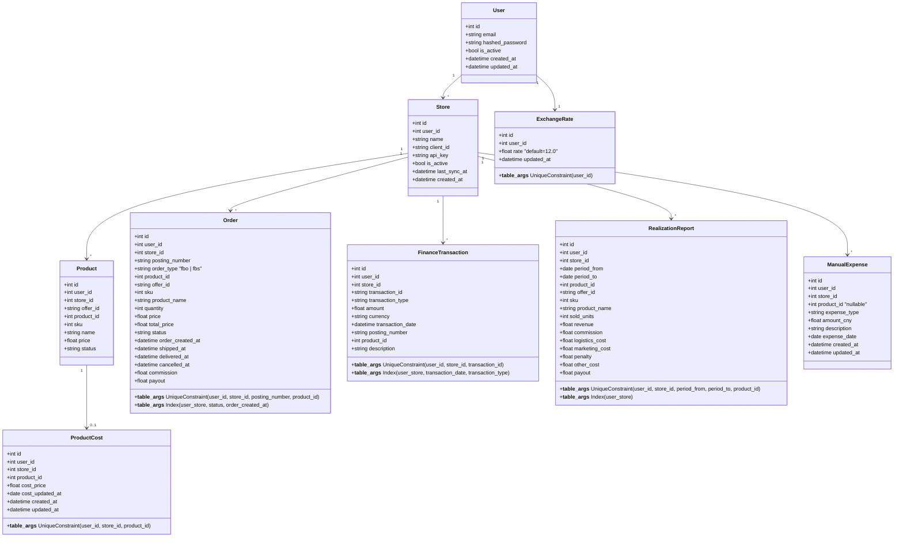
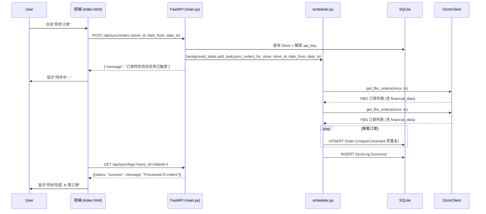
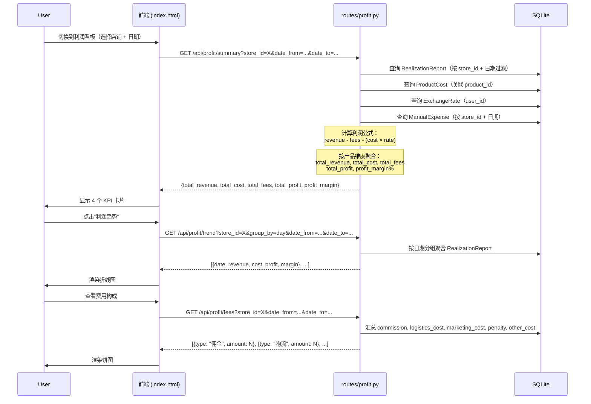
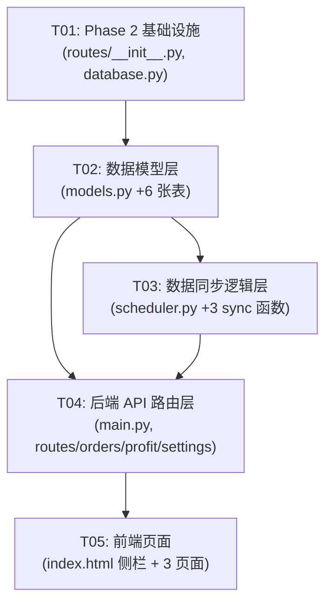

# Ozon Analytics Phase 2 — 系统架构与任务分解

> **增量开发说明**：本文档在 Phase 1 现有架构基础上做增量设计，不改变已有代码结构，仅在关键位置添加新功能。

---

## 1. 实现方案 + 框架选型（架构变更说明）

### 1.1 核心技术挑战

| 挑战 | 解决方案 |
|------|----------|
| 6 张新表与现有模型的关联 | 新增模型复用 `user_id`、`store_id` 体系，通过外键语义关联到已有 `Product` 表 |
| 3 种新数据源（FBO/FBS 订单、财务交易、销售实现报告）的同步 | 复用现有 `OzonClient` 中已实现的 API 方法；复用 `_make_ozon_client`、同步日志、错误处理等模式 |
| 利润计算的跨表聚合 | 在 API 层通过 SQLAlchemy JOIN + 内存计算实现，不做物化视图（保持简单） |
| 前端多页面（订单/利润/设置） | 沿用现有单 HTML 模式，添加侧栏导航 + 页面区块 |

### 1.2 选型（全部沿用 Phase 1）

| 层面 | 技术选择 | 说明 |
|------|----------|------|
| 后端框架 | FastAPI | 无变更 |
| ORM | SQLAlchemy | 无变更 |
| 数据库 | SQLite/PostgreSQL | 无变更 |
| API 客户端 | OzonClient（已有） | 新增方法已在 Phase 1 实现 |
| 定时任务 | APScheduler | 无变更 |
| 前端 | 原生 HTML + ECharts + vanilla JS | 无变更 |
| 认证 | JWT（已有 auth.py） | 无变更 |

### 1.3 架构变更

```
Phase 1 架构：
  main.py (所有路由)
    ├── auth.py (JWT 认证)
    ├── models.py (数据模型)
    ├── database.py (DB 初始化)
    ├── scheduler.py (同步逻辑)
    ├── ozon_client.py (Ozon API)
    ├── crypto.py (加密)
    └── scheduler_worker.py (定时任务进程)

Phase 2 新增：
  main.py (现有路由不变 + 新增路由模块引用)
    ├── routes/           ← 新增：Phase 2 路由模块
    │   ├── __init__.py
    │   ├── orders.py     (订单查询 API)
    │   ├── profit.py     (利润计算 API)
    │   └── settings.py   (设置管理 API)
    ├── models.py         (新增 6 张表)
    ├── scheduler.py      (新增 3 个同步函数)
    ├── scheduler_worker.py (新增定时任务)
    └── frontend/
        └── index.html    (新增侧栏导航 + 3 个页面区块)
```

**设计决策**：Phase 2 新增大量 API（约 15 个），若全部塞入 `main.py` 会导致文件过长。因此将 Phase 2 的路由拆分为独立模块文件，通过 `app.include_router()` 注册到主应用。同步 API 仍在 `main.py` 中（与已有 `/api/sync/` 路由同目录）。

---

## 2. 文件列表及相对路径

### 2.1 修改的文件

| 文件路径 | 操作 | 说明 |
|----------|------|------|
| `backend/models.py` | 修改 | 新增 6 个 SQLAlchemy 模型 |
| `backend/database.py` | 修改 | 更新 `init_db()` 导入新模型 |
| `backend/scheduler.py` | 修改 | 新增 3 个同步函数 |
| `backend/scheduler_worker.py` | 修改 | 新增定时任务注册 |
| `backend/main.py` | 修改 | 新增 Phase 2 API 路由注册 + 新增 sync 端点 |
| `frontend/index.html` | 修改 | 新增侧栏导航 + 订单/利润/设置页面区块 |

### 2.2 新增的文件

| 文件路径 | 操作 | 说明 |
|----------|------|------|
| `backend/routes/__init__.py` | 新增 | 空文件，标识包 |
| `backend/routes/orders.py` | 新增 | 订单查询 API 路由 |
| `backend/routes/profit.py` | 新增 | 利润计算 API 路由 |
| `backend/routes/settings.py` | 新增 | 设置管理 API 路由 |

### 2.3 文件职责总览

```
backend/
├── routes/                  # [新增] Phase 2 路由模块
│   ├── __init__.py          # 空文件
│   ├── orders.py            # GET /api/orders, GET /api/orders/{posting_number}
│   ├── profit.py            # GET /api/profit/summary|trend|products|fees|detail
│   └── settings.py          # ExchangeRate CRUD, ProductCost CRUD, ManualExpense CRUD
├── models.py                # [修改] +6 models
├── database.py              # [修改] init_db 导入新模型
├── scheduler.py             # [修改] +3 sync 函数
├── scheduler_worker.py      # [修改] +定时任务注册
├── main.py                  # [修改] +Phase 2 API 注册 + sync 端点
frontend/
└── index.html               # [修改] +侧栏 + 3 个页面区块
```

---

## 3. 数据结构和类图

### 3.1 新增模型关系

```
现有模型：User 1 ── * Store 1 ── * Product
                                     1 ── * AnalyticsDaily (已有)

Phase 2 新增模型：
Store 1 ── * Order              (订单)
Store 1 ── * FinanceTransaction (财务交易)
Store 1 ── * RealizationReport  (销售实现报告)
Product 1 ── 1 ProductCost      (采购成本, 可有可无)
Store 1 ── * ManualExpense      (手动费用, 可选关联 Product)
User 1 ── 1 ExchangeRate        (汇率, 每个用户一条)
```

### 3.2 Mermaid Class Diagram



---

## 4. 程序调用流程

### 4.1 手动同步订单流程



### 4.2 利润查询流程



---

## 5. 利润公式（核心业务规则）

```
利润(RUB) = RealizationReport.revenue 
          - 费用合计 
          - (ProductCost.cost_price × ExchangeRate.rate)

费用合计 = commission + logistics_cost + marketing_cost 
          + penalty + other_cost 
          + ManualExpense(按当时汇率转 RUB)

毛利率 = 利润 / revenue × 100%

其中:
- revenue、commission、logistics_cost 等来自 RealizationReport
- cost_price 来自 ProductCost（用户手动填写，缺失则不扣除）
- rate 来自 ExchangeRate（用户手动配置，默认 12.0）
- ManualExpense 的 amount_cny × rate 转为 RUB 计入费用
```

---

## 6. 任务列表（有序、含依赖关系）

### T01: Phase 2 项目基础设施

| 属性 | 值 |
|------|-----|
| **Task ID** | T01 |
| **优先级** | P0 |
| **依赖** | 无 |
| **说明** | 创建 Phase 2 目录结构，更新数据库初始化，确保新模型能被正确创建 |

**涉及文件：**

| 文件 | 操作 | 具体修改 |
|------|------|----------|
| `backend/routes/__init__.py` | **新增** | 空文件，标识 Python 包 |
| `backend/database.py` | **修改** | 在 `init_db()` 中添加 Phase 2 模型的 import 引用 |
| `backend/__init__.py` | **新增** | 空文件（若不存在），确保 backend 为 Python 包 |

---

### T02: 数据模型层（6 张新表）

| 属性 | 值 |
|------|-----|
| **Task ID** | T02 |
| **优先级** | P0 |
| **依赖** | T01 |

**涉及文件：**

| 文件 | 操作 | 具体修改 |
|------|------|----------|
| `backend/models.py` | **修改** | 新增 6 个 SQLAlchemy 模型类（Order, FinanceTransaction, RealizationReport, ProductCost, ManualExpense, ExchangeRate），含所有字段定义、约束、索引 |
| `backend/database.py` | **修改** | `init_db()` 中的 `from models import ...` 添加新模型引用 |
| (无第三方依赖) | — | Phase 2 无需安装新包 |

**Order 模型关键字段：**
- `posting_number`, `order_type`, `product_id`, `offer_id`, `sku`, `product_name`, `quantity`, `price`, `total_price`, `status`
- `order_created_at`, `shipped_at`, `delivered_at`, `cancelled_at`
- `commission`, `payout`
- `__table_args__`: UniqueConstraint(user_id, store_id, posting_number, product_id), Index("idx_order_status", "status"), Index("idx_order_created_at", "order_created_at")

**FinanceTransaction 模型关键字段：**
- `transaction_id` (Ozon 唯一ID), `transaction_type`, `amount`, `currency`, `transaction_date`
- `posting_number`, `product_id`, `description`
- `__table_args__`: UniqueConstraint(user_id, store_id, transaction_id)

**RealizationReport 模型关键字段：**
- `period_from`, `period_to` (日期范围), `product_id`, `offer_id`, `sku`, `product_name`
- `sold_units`, `revenue`, `commission`, `logistics_cost`, `marketing_cost`, `penalty`, `other_cost`, `payout`
- `__table_args__`: UniqueConstraint(user_id, store_id, period_from, period_to, product_id)

**ProductCost 模型：**
- `product_id`, `cost_price` (采购成本), `cost_updated_at`
- `__table_args__`: UniqueConstraint(user_id, store_id, product_id)

**ManualExpense 模型：**
- `product_id` (nullable), `expense_type` (如"广告费"、"物流附加费"等), `amount_cny` (人民币), `description`, `expense_date`

**ExchangeRate 模型：**
- `rate` (默认 12.0), `updated_at`, 每个 user 一条记录

---

### T03: 数据同步逻辑层

| 属性 | 值 |
|------|-----|
| **Task ID** | T03 |
| **优先级** | P0 |
| **依赖** | T02 |

**涉及文件：**

| 文件 | 操作 | 具体修改 |
|------|------|----------|
| `backend/scheduler.py` | **修改** | 新增 3 个同步函数 + 辅助解析函数 |
| `backend/scheduler_worker.py` | **修改** | 注册 Phase 2 定时同步任务 |
| `backend/ozon_client.py` | **不改** | 所需 API 方法已在 Phase 1 实现 |

**新增同步函数：**

```python
def sync_orders_for_store(store_id: int, date_from: str, date_to: str):
    """同步 FBO + FBS 订单
    - 调用 OzonClient.get_fbo_orders() 获取 FBO 订单
    - 调用 OzonClient.get_fbs_orders() 获取 FBS 订单（支持翻页）
    - 解析 financial_data 提取 commission/payout
    - UPSERT Order 表
    - 记录 SyncLog
    """

def sync_finance_for_store(store_id: int, date_from: str, date_to: str):
    """同步财务交易明细
    - 调用 OzonClient.get_finance_transactions()（支持翻页）
    - 解析 transaction_type / amount / description
    - UPSERT FinanceTransaction 表
    - 记录 SyncLog
    """

def sync_realization_for_store(store_id: int, date_from: str, date_to: str):
    """同步销售实现报告
    - 调用 OzonClient.get_realization()（支持翻页）
    - 解析每个商品维度的结算明细（含所有扣费）
    - UPSERT RealizationReport 表
    - 记录 SyncLog
    """

def sync_all_phase2(store_id: int):
    """一键同步所有 Phase 2 数据（订单+财务+销售实现）"""

def sync_orders_all_stores():
    """定时任务：同步所有活跃店铺的订单（近 2 天）"""

def sync_finance_all_stores():
    """定时任务：同步所有活跃店铺的财务交易（近 2 天）"""

def sync_realization_all_stores():
    """定时任务：同步所有活跃店铺的销售实现报告（近 2 天）"""
```

**定时任务注册（scheduler_worker.py 更新）：**
```
- 每日 08:00: sync_analytics_all_stores (已有)
- 每日 08:30: sync_orders_all_stores (新增)
- 每日 09:00: sync_finance_all_stores (新增)
- 每日 09:30: sync_realization_all_stores (新增)
```

---

### T04: 后端 API 路由层

| 属性 | 值 |
|------|-----|
| **Task ID** | T04 |
| **优先级** | P0 |
| **依赖** | T02, T03 |

**涉及文件：**

| 文件 | 操作 | 具体 API |
|------|------|----------|
| `backend/main.py` | **修改** | 注册 Phase 2 routers + 新增 3 个 sync API 端点 |
| `backend/routes/orders.py` | **新增** | 订单查询 API |
| `backend/routes/profit.py` | **新增** | 利润计算 API |
| `backend/routes/settings.py` | **新增** | 设置管理 API |

**sync API（main.py 中新增，与已有 sync API 位于同一文件）：**

| 方法 | 路径 | 说明 |
|------|------|------|
| POST | `/api/sync/orders` | 同步订单（参数: store_id, date_from, date_to） |
| POST | `/api/sync/finance` | 同步财务交易 |
| POST | `/api/sync/realization` | 同步销售实现报告 |

**orders.py（新增路由文件）：**

| 方法 | 路径 | 说明 |
|------|------|------|
| GET | `/api/orders` | 查询订单列表（参数: store_id, status, product_id, date_from, date_to, page, page_size） |
| GET | `/api/orders/{posting_number}` | 订单详情（含商品行） |

**profit.py（新增路由文件）：**

| 方法 | 路径 | 说明 |
|------|------|------|
| GET | `/api/profit/summary` | 利润 KPI 摘要：total_revenue, total_cost, total_fees, total_profit, profit_margin |
| GET | `/api/profit/trend` | 利润趋势（参数: group_by=day\|week\|month, store_id, date_from, date_to） |
| GET | `/api/profit/products` | 商品利润排行（参数: limit, store_id, date_from, date_to） |
| GET | `/api/profit/fees` | 费用构成（按类型汇总：佣金/物流/广告/罚款/其他） |
| GET | `/api/profit/detail` | 利润明细表格数据（分页+筛选+排序） |

**settings.py（新增路由文件）：**

| 方法 | 路径 | 说明 |
|------|------|------|
| GET | `/api/settings/exchange-rate` | 获取汇率 |
| PUT | `/api/settings/exchange-rate` | 更新汇率（参数: rate） |
| PUT | `/api/products/{product_id}/cost` | 更新采购成本 |
| GET | `/api/expenses` | 列出手动费用 |
| POST | `/api/expenses` | 新增手动费用 |
| PUT | `/api/expenses/{id}` | 编辑手动费用 |
| DELETE | `/api/expenses/{id}` | 删除手动费用 |
| GET | `/api/export/profit-csv` | 导出利润明细 CSV |

**Profit 计算实现要点：**
```python
# 伪代码：profit/summary 实现
def get_profit_summary(store_id, date_from, date_to, user_id):
    # 1. 查询 RealizationReport 汇总
    rows = db.query(RealizationReport).filter(
        store_id=store_id, user_id=user_id,
        period_from >= date_from, period_to <= date_to
    ).all()
    
    # 2. 获取汇率
    rate = db.query(ExchangeRate).filter_by(user_id=user_id).first()
    rate_val = rate.rate if rate else 12.0
    
    # 3. 获取采购成本映射
    costs = db.query(ProductCost).filter_by(store_id=store_id, user_id=user_id).all()
    cost_map = {c.product_id: c.cost_price for c in costs}
    
    # 4. 获取手动费用
    expenses = db.query(ManualExpense).filter_by(store_id=store_id, user_id=user_id).all()
    total_expense_cny = sum(e.amount_cny for e in expenses)
    total_expense_rub = total_expense_cny * rate_val
    
    # 5. 逐行计算
    total_revenue = sum(r.revenue for r in rows)
    total_fees = sum(
        r.commission + r.logistics_cost + r.marketing_cost 
        + r.penalty + r.other_cost for r in rows
    ) + total_expense_rub
    total_cost = sum(
        cost_map.get(r.product_id, 0) * rate_val for r in rows
    )
    total_profit = total_revenue - total_fees - total_cost
    profit_margin = (total_profit / total_revenue * 100) if total_revenue > 0 else 0
    
    return {
        "total_revenue": round(total_revenue, 2),
        "total_cost": round(total_cost, 2),
        "total_fees": round(total_fees, 2),
        "total_profit": round(total_profit, 2),
        "profit_margin": round(profit_margin, 2),
    }
```

---

### T05: 前端页面（订单管理 + 利润看板 + 设置）

| 属性 | 值 |
|------|-----|
| **Task ID** | T05 |
| **优先级** | P0 |
| **依赖** | T04 |

**涉及文件：**

| 文件 | 操作 | 说明 |
|------|------|------|
| `frontend/index.html` | **修改** | 新增侧栏导航 + 3 个页面区块 + JS 逻辑 |

**前端具体变更：**

**1. 侧栏导航**（替换现有顶部 Header 布局）
```
[Logo] Ozon Analytics
├── 📊 分析看板 (已有)
├── 📦 订单管理 (新增)
├── 💰 利润看板 (新增)
└── ⚙️ 设置 (新增)
```

**2. 订单管理页面** (`#page-orders`)
- 筛选器：店铺、日期范围、状态（全部/待发货/已发货/已送达/已取消）
- 订单列表表格：发货单号 | 类型(FBO/FBS) | 商品 | 数量 | 金额 | 佣金 | 状态 | 日期
- 订单详情弹窗：点击行 → 显示完整订单信息 + 商品行列表

**3. 利润看板页面** (`#page-profit`)
- 4 个 KPI 卡片：总收入 | 总成本 | 总费用 | 净利润 + 毛利率
- 利润趋势折线图（ECharts，支持按日/周/月聚合）
- 商品利润排行柱状图（Top N）
- 费用构成饼图（佣金/物流/广告/罚款/其他）
- 利润明细表格（分页、排序、筛选）+ CSV 导出按钮

**4. 设置页面** (`#page-settings`)
- 汇率编辑（数字输入框）
- 采购成本搜编（商品搜索框 + 表格 + 行内编辑）
- 手动费用补录表单 + 历史列表

**JS 核心函数：**
```javascript
// 页面路由
navigateTo(page) → show/hide page sections

// 订单页面
loadOrders(storeId, filters) → GET /api/orders
showOrderDetail(postingNumber) → GET /api/orders/{posting_number}

// 利润页面
loadProfitSummary(storeId, dates) → GET /api/profit/summary
loadProfitTrend(storeId, dates, groupBy) → GET /api/profit/trend
loadProfitProducts(storeId, dates) → GET /api/profit/products
loadProfitFees(storeId, dates) → GET /api/profit/fees
loadProfitDetail(storeId, dates, page) → GET /api/profit/detail
exportProfitCSV(storeId, dates) → GET /api/export/profit-csv

// 设置页面
loadExchangeRate() → GET /api/settings/exchange-rate
updateExchangeRate(rate) → PUT /api/settings/exchange-rate
updateProductCost(productId, cost) → PUT /api/products/{product_id}/cost
loadExpenses() → GET /api/expenses
addExpense(data) → POST /api/expenses
```

---

## 7. 依赖包列表

Phase 2 **无需新增任何第三方依赖包**。所有依赖已在 Phase 1 安装：

```
fastapi>=0.104.0
uvicorn[standard]>=0.24.0
sqlalchemy>=2.0.23
apscheduler>=3.10.4
requests>=2.31.0
python-dotenv>=1.0.0
python-jose[cryptography]>=3.3.0
passlib[bcrypt]>=1.7.4
bcrypt>=4.0.0
cryptography>=41.0.0
```

---

## 8. 共享知识（跨文件约定）

### 8.1 响应格式
```json
// 成功响应
{"code": 0, "data": {...}, "message": "success"}

// 错误响应（沿用 FastAPI HTTPException 模式）
{"detail": "错误信息"}
```

### 8.2 日期格式
- API 请求参数：`YYYY-MM-DD`
- 数据库存储：SQLAlchemy `Date` / `DateTime` 类型
- API JSON 响应：`YYYY-MM-DD`（日期） / ISO 8601（时间戳）
- Ozon API 传入：FBO/FBS 用 `since/to`（带时间的 ISO 格式），财务用 `date_from/date_to`（日期）

### 8.3 货币约定
- **RUB（卢布）**：订单金额、费用、利润等 Ozon 原始数据使用 RUB
- **CNY（人民币）**：`ManualExpense.amount_cny` 用户手动输入使用 CNY
- **汇率转换**：手动费用 × ExchangeRate.rate → RUB，仅在利润计算时转换
- **存储精度**：`Float` 类型，显示时保留 2 位小数

### 8.4 数据库约定
- 所有表包含 `user_id` 字段（多租户隔离）
- 所有表使用 `UniqueConstraint` 防重复（幂等 UPSERT 逻辑）
- 更新时间字段：`created_at`（`server_default=func.now()`），`updated_at`（+ `onupdate`）

### 8.5 同步逻辑约定
- 同步函数风格完全沿用 Phase 1：独立 db session、try/except/finally、SyncLog 记录
- 翻页同步参考 `get_all_analytics_data` 的模式
- 全部使用 `BackgroundTasks` 异步触发（不阻塞 HTTP 响应）
- 错误处理使用 Phase 1 已有模式（友好提示 + 日志堆栈）

### 8.6 API 认证
- 所有 `/api/*` 路由通过 `Depends(get_current_user)` 鉴权
- 认证逻辑完全复用 `auth.py` 的 JWT 机制

### 8.7 分页约定
```json
// 请求参数
GET /api/orders?store_id=1&page=1&page_size=20

// 响应格式
{
    "items": [...],
    "total": 150,
    "page": 1,
    "page_size": 20,
    "total_pages": 8
}
```

### 8.8 ECharts 数据格式
前端 ECharts 图表数据格式沿用 Phase 1 模式：
- 折线图：`{ dates: [...], series: [{ name, data, ... }] }`
- 柱状图：`{ categories: [...], values: [...] }`
- 饼图：`[{ name, value }, ...]`

---

## 9. 待明确事项

1. **Ozon API 翻页确认**：`get_fbo_orders` 和 `get_fbs_orders` 方法已按单页实现。确认是否需要翻页处理（FBO 订单量通常不大，单页 100 条可能够；FBS 如果订单量大需要翻页）。
2. **订单状态枚举**：Ozon FBO/FBS 订单可能的状态值需要在同步时确认，以便前端筛选器枚举。建议在实现时实际观察 Ozon API 返回的 `status` 值。
3. **Realization 报告数据模型**：Ozon `/v2/finance/realization` 返回的字段结构需在实际同步时验证。模型字段设计参考了 PRD 描述，但实际 Ozon 返回的字段名可能略有不同。
4. **手动费用汇率**：手动费用是在录入时按当时汇率转 RUB 存储，还是在查询时实时转换？本文采用"查询时实时转换"方案（费用存 CNY，查询时 × 当前汇率），更为灵活。
5. **库存单位（SKU）映射**：RealizationReport 和 Order 通过 `product_id` 关联到 Product 表。确保 `product_id` 在 Ozon 生态中跨系统一致。

---

## 10. 任务依赖图



**实现顺序建议：**
```
T01 (基础设施) → T02 (数据模型) → T03 (同步逻辑) → T04 (API) → T05 (前端)
                 ↗                                ↗
            (T02 提前完成可并行开始 T03 独立模块)
```
