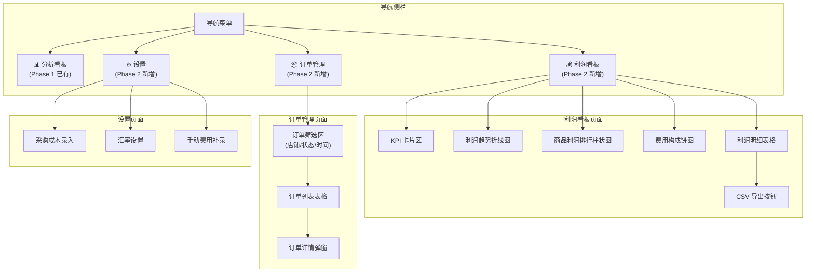

# Ozon Analytics Phase 2 — 订单与利润看板 PRD

> **版本**: v1.0  
> **编写**: Product Manager (Alice)  
> **日期**: 2026-06-05  
> **项目**: ozon_analytics_saas  
> **前置**: Phase 1 SaaS 改造已完成（多租户 + JWT 认证 + 数据隔离）

---

## 1. 项目信息

- **Language**: 中文
- **Programming Language**: Python (FastAPI) + SQLAlchemy + 原生前端 (ECharts)
- **Project Name**: ozon_analytics_saas
- **原始需求**: 在已有 Ozon Analytics 数据分析系统基础上，接入 Ozon Seller API 的订单和财务数据，实现真实利润看板。用户能查看"赚了多少"而非仅"卖了多少"。

---

## 2. 产品定义

### 2.1 产品目标

> **一句话目标**: 接入订单与财务数据，通过利润公式（销售收入 - 采购成本 - 平台费用）为用户提供按商品/店铺/时间维度的真实利润看板。

三个正交目标：

1. **打通订单链路** — 同步 FBO/FBS 订单数据，追踪订单全生命周期状态
2. **接入财务数据** — 同步 Ozon 财务交易和销售实现报告，自动提取佣金/广告/物流等费用
3. **实现利润计算** — 结合用户录入的采购成本和 API 财务数据，按多维度展示真实利润和利润率

### 2.2 用户故事

| 角色 | 需求 | 价值 |
|------|------|------|
| 作为**跨境电商卖家**，我想要**系统自动同步我的 FBO/FBS 订单**，以便**在一个地方追踪所有订单状态** |
| 作为**卖家**，我想要**自动抓取 Ozon 平台佣金、广告费、罚款等财务明细**，以便**清晰了解每一笔费用的去向** |
| 作为**卖家**，我想要**录入每个商品的采购成本（CNY）和维护汇率**，以便**系统自动计算真实利润** |
| 作为**卖家**，我想要**在利润看板上按商品/店铺/时间维度查看收入、成本、费用和毛利率**，以便**快速识别最赚钱和最亏钱的产品** |
| 作为**卖家**，我想要**手动补录头程物流、关税等额外费用**，以便**我的利润计算覆盖全部真实成本** |

---

## 3. 技术规范

### 3.1 数据模型变更

#### 新增：Order（订单）表

```python
class Order(Base):
    """订单数据（FBO + FBS 统一模型）"""
    __tablename__ = "orders"

    id = Column(Integer, primary_key=True, autoincrement=True)
    user_id = Column(Integer, nullable=False, comment="所属用户ID")
    store_id = Column(Integer, nullable=False, comment="所属店铺ID")
    posting_number = Column(String(100), nullable=False, comment="Ozon 订单号")

    # 订单类型
    order_type = Column(String(20), nullable=False, comment="订单类型: fbo/fbs")

    # 商品信息
    product_id = Column(Integer, nullable=False, comment="Ozon商品ID")
    offer_id = Column(String(100), comment="卖家货号")
    sku = Column(Integer, comment="SKU")
    product_name = Column(String(500), comment="商品名称")
    quantity = Column(Integer, default=1, comment="数量")
    price = Column(Float, default=0.0, comment="单价(RUB)")
    total_price = Column(Float, default=0.0, comment="总价(RUB)")

    # 订单状态
    status = Column(String(50), nullable=False, comment="订单状态")
    # FBS 状态: awaiting_packaging, awaiting_deliver, delivering, delivered, cancelled
    # FBO 状态: shipped_in_process, shipped, delivered, cancelled

    # 时间
    order_created_at = Column(DateTime, comment="订单创建时间")
    shipped_at = Column(DateTime, comment="发货时间")
    delivered_at = Column(DateTime, comment="交付时间")
    cancelled_at = Column(DateTime, comment="取消时间")

    # 财务（从订单接口获取）
    commission = Column(Float, default=0.0, comment="佣金(RUB)")
    payout = Column(Float, default=0.0, comment="实际结算金额(RUB)")

    created_at = Column(DateTime, server_default=func.now())
    updated_at = Column(DateTime, server_default=func.now(), onupdate=func.now())

    __table_args__ = (
        UniqueConstraint("user_id", "store_id", "posting_number", "product_id",
                         name="uq_user_order_posting_product"),
        Index("idx_orders_user_store", "user_id", "store_id"),
        Index("idx_orders_status", "status"),
        Index("idx_orders_date", "order_created_at"),
    )
```

#### 新增：FinanceTransaction（财务交易）表

```python
class FinanceTransaction(Base):
    """Ozon 财务交易明细"""
    __tablename__ = "finance_transactions"

    id = Column(Integer, primary_key=True, autoincrement=True)
    user_id = Column(Integer, nullable=False, comment="所属用户ID")
    store_id = Column(Integer, nullable=False, comment="所属店铺ID")

    # Ozon 交易标识
    transaction_id = Column(String(100), nullable=False, comment="Ozon 交易ID")
    transaction_type = Column(String(50), nullable=False, comment="交易类型")
    # 例如: commission(佣金), marketing(广告费), fulfillment(物流),
    #       penaltiy(罚款), refund(退款), payout(结算收入)

    amount = Column(Float, nullable=False, comment="金额(RUB, 负数为支出)")
    currency = Column(String(10), default="RUB", comment="货币")
    transaction_date = Column(DateTime, nullable=False, comment="交易日期")

    # 关联信息
    posting_number = Column(String(100), comment="关联订单号")
    product_id = Column(Integer, comment="关联商品ID")
    description = Column(String(500), comment="交易描述")

    created_at = Column(DateTime, server_default=func.now())

    __table_args__ = (
        UniqueConstraint("user_id", "store_id", "transaction_id",
                         name="uq_user_finance_transaction"),
        Index("idx_finance_user_store", "user_id", "store_id"),
        Index("idx_finance_date", "transaction_date"),
        Index("idx_finance_type", "transaction_type"),
    )
```

#### 新增：RealizationReport（销售实现报告）表

```python
class RealizationReport(Base):
    """销售实现报告（按商品的结算明细）"""
    __tablename__ = "realization_reports"

    id = Column(Integer, primary_key=True, autoincrement=True)
    user_id = Column(Integer, nullable=False, comment="所属用户ID")
    store_id = Column(Integer, nullable=False, comment="所属店铺ID")

    # 报告期间
    period_from = Column(Date, nullable=False, comment="期间开始")
    period_to = Column(Date, nullable=False, comment="期间结束")

    # 商品维度
    product_id = Column(Integer, nullable=False, comment="Ozon商品ID")
    offer_id = Column(String(100), comment="卖家货号")
    sku = Column(Integer, comment="SKU")
    product_name = Column(String(500), comment="商品名称")

    # 核心结算数据
    sold_units = Column(Integer, default=0, comment="销售数量")
    revenue = Column(Float, default=0.0, comment="销售收入(RUB)")
    commission = Column(Float, default=0.0, comment="佣金(RUB)")
    logistics_cost = Column(Float, default=0.0, comment="物流费(RUB)")
    marketing_cost = Column(Float, default=0.0, comment="广告营销费(RUB)")
    penalty = Column(Float, default=0.0, comment="罚款(RUB)")
    other_cost = Column(Float, default=0.0, comment="其他费用(RUB)")
    payout = Column(Float, default=0.0, comment="实际结算金额(RUB)")

    created_at = Column(DateTime, server_default=func.now())

    __table_args__ = (
        UniqueConstraint("user_id", "store_id", "period_from", "period_to", "product_id",
                         name="uq_user_realization_product_period"),
        Index("idx_realization_user_store", "user_id", "store_id"),
    )
```

#### 新增：ProductCost（采购成本）表

```python
class ProductCost(Base):
    """商品采购成本（用户手动录入）"""
    __tablename__ = "product_costs"

    id = Column(Integer, primary_key=True, autoincrement=True)
    user_id = Column(Integer, nullable=False, comment="所属用户ID")
    store_id = Column(Integer, nullable=False, comment="所属店铺ID")
    product_id = Column(Integer, nullable=False, comment="Ozon商品ID")

    cost_price = Column(Float, default=0.0, comment="采购成本(CNY)")
    cost_updated_at = Column(DateTime, comment="成本最后更新时间")

    created_at = Column(DateTime, server_default=func.now())
    updated_at = Column(DateTime, server_default=func.now(), onupdate=func.now())

    __table_args__ = (
        UniqueConstraint("user_id", "store_id", "product_id",
                         name="uq_user_product_cost"),
    )
```

#### 新增：ManualExpense（手动补录费用）表

```python
class ManualExpense(Base):
    """手动补录费用（头程物流、关税等）"""
    __tablename__ = "manual_expenses"

    id = Column(Integer, primary_key=True, autoincrement=True)
    user_id = Column(Integer, nullable=False, comment="所属用户ID")
    store_id = Column(Integer, nullable=False, comment="所属店铺ID")

    product_id = Column(Integer, comment="关联商品ID（可为空，为空则均摊）")
    expense_type = Column(String(50), nullable=False, comment="费用类型: logistics/customs/other")
    amount_cny = Column(Float, nullable=False, comment="金额(CNY)")
    description = Column(String(500), comment="费用说明")
    expense_date = Column(Date, comment="费用发生日期")

    created_at = Column(DateTime, server_default=func.now())
    updated_at = Column(DateTime, server_default=func.now(), onupdate=func.now())
```

#### 新增：ExchangeRate（汇率配置）表

```python
class ExchangeRate(Base):
    """汇率配置（用户维护）"""
    __tablename__ = "exchange_rates"

    id = Column(Integer, primary_key=True, autoincrement=True)
    user_id = Column(Integer, nullable=False, comment="所属用户ID")
    rate = Column(Float, nullable=False, default=12.0, comment="1 CNY = ? RUB")
    updated_at = Column(DateTime, server_default=func.now(), onupdate=func.now())
```

#### Product 表新增字段

```python
# 在现有 Product 模型中新增
cost_price = Column(Float, default=0.0, comment="采购成本(CNY)")  # 可选冗余字段
```

### 3.2 利润计算公式

```
利润(RUB) = 销售收入 - 费用合计 - 采购成本(RUB)

其中：
  销售收入       = RealizationReport.revenue（或 Order.total_price 汇总）
  费用合计       = 佣金 + 物流费 + 广告费 + 罚款 + 其他费用 + 手动补录费用
  采购成本(RUB)  = ProductCost.cost_price × ExchangeRate.rate

毛利率 = 利润 / 销售收入 × 100%
```

**数据来源优先级：**
- **销售收入**: RealizationReport.payout 优先（实际结算），其次 Order.total_price（下单金额）
- **佣金/物流/广告等**: RealizationReport 各费用字段 + FinanceTransaction 交易明细（互相校验）
- **采购成本**: ProductCost 用户录入 + 汇率表换算
- **额外费用**: ManualExpense 手动补录

### 3.3 需求池

#### P0（必须，上线必备）

| 编号 | 需求 | 说明 |
|------|------|------|
| P0-1 | **数据模型实现** | 新建 Order、FinanceTransaction、RealizationReport、ProductCost、ManualExpense、ExchangeRate 六张表 |
| P0-2 | **FBO/FBS 订单同步 API** | `POST /api/sync/orders` — 调用 OzonClient.get_fbo_orders() / get_fbs_orders() 同步近 30 天订单（支持翻页），写入 orders 表 |
| P0-3 | **财务交易同步 API** | `POST /api/sync/finance` — 调用 OzonClient.get_finance_transactions() 同步财务交易，写入 finance_transactions 表 |
| P0-4 | **销售实现报告同步 API** | `POST /api/sync/realization` — 调用 OzonClient.get_realization() 同步销售实现报告，写入 realization_reports 表 |
| P0-5 | **订单列表查询 API** | `GET /api/orders?store_id=&status=&page=&page_size=` — 按店铺、状态、时间范围查询订单列表 |
| P0-6 | **利润数据查询 API** | `GET /api/profit?store_id=&product_id=&date_from=&date_to=&group_by=day|week|month` — 按维度返回利润数据 |
| P0-7 | **成本录入 API** | `PUT /api/products/{product_id}/cost` — 更新商品采购成本 |
| P0-8 | **汇率配置 API** | `GET/PUT /api/settings/exchange-rate` — 查询和更新汇率 |
| P0-9 | **手动费用 CRUD API** | `GET/POST/PUT/DELETE /api/expenses` — 手动补录费用的增删改查 |
| P0-10 | **利润看板前端页面** | 核心 KPI 卡片 + 趋势图 + 商品排行 + 费用构成饼图 + 利润明细表格 |
| P0-11 | **CSV 导出利润明细** | `GET /api/export/profit-csv?...` — 利润明细可导出 CSV |
| P0-12 | **定时任务更新** | scheduler 增加订单/财务/实现报告同步（每日 08:00 + 可选每小时订单同步） |

#### P1（重要，可后补）

| 编号 | 需求 | 说明 |
|------|------|------|
| P1-1 | **订单详情页** | 单笔订单详情查看（商品明细、费用明细、物流追踪） |
| P1-2 | **财务交易流水页** | 以表格形式展示所有财务交易记录，支持按类型筛选 |
| P1-3 | **成本批量导入** | 支持 CSV 批量导入商品采购成本（offer_id + cost_price） |
| P1-4 | **利润日历热力图** | 按日展示利润高低的热力图 |
| P1-5 | **利润仪表盘全屏模式** | 一键全屏查看看板 |

#### P2（增强体验）

| 编号 | 需求 | 说明 |
|------|------|------|
| P2-1 | **自动汇率** | 接入免费汇率 API 自动获取 CNY/RUB 汇率 |
| P2-2 | **利润预警** | 当商品毛利率低于阈值时发出告警 |
| P2-3 | **利润对比** | 同期对比（本周 vs 上周，本月 vs 上月） |
| P2-4 | **利润看板分享** | 生成分享链接（只读视图） |

### 3.4 API 设计草案

#### 新增 API

| 方法 | 路径 | 说明 |
|------|------|------|
| POST | `/api/sync/orders` | 同步订单（FBO+FBS） |
| POST | `/api/sync/finance` | 同步财务交易 |
| POST | `/api/sync/realization` | 同步销售实现报告 |
| GET | `/api/orders` | 查询订单列表 |
| GET | `/api/orders/{posting_number}` | 订单详情 |
| GET | `/api/profit/summary` | 利润 KPI 摘要数据 |
| GET | `/api/profit/trend` | 利润趋势（日/周/月） |
| GET | `/api/profit/products` | 商品利润排行 |
| GET | `/api/profit/fees` | 费用构成明细 |
| GET | `/api/profit/detail` | 利润明细表格数据 |
| PUT | `/api/products/{product_id}/cost` | 更新采购成本 |
| GET | `/api/settings/exchange-rate` | 获取汇率 |
| PUT | `/api/settings/exchange-rate` | 更新汇率 |
| GET/POST/PUT/DELETE | `/api/expenses` | 手动费用 CRUD |
| GET | `/api/export/profit-csv` | 导出利润 CSV |

### 3.5 同步策略

```
定时任务（每日 08:00）：
  1. 订单同步 → 获取最近 30 天 FBO + FBS 订单（UPSERT）
  2. 财务交易同步 → 获取最近 30 天交易明细（UPSERT）
  3. 销售实现报告同步 → 获取最近 30 天实现报告（UPSERT）

手动同步（用户触发）：
  - 支持手动触发任意同步类型
  - 支持选择日期范围
  - 记录同步日志到 sync_logs 表
```

---

## 4. UI 设计稿

### 4.1 页面结构总览



### 4.2 利润看板页面布局

```
┌──────────────────────────────────────────────────────────────┐
│  Ozon Analytics  [BETA]                    user@email  [退出] │
├──────────────────────────────────────────────────────────────┤
│ ┌──────────────┐  ┌─────────────────────────────────────────┐│
│ │ 📊 分析看板   │  │  利润看板                                ││
│ │ 📦 订单管理   │  │                                         ││
│ │ 💰 利润看板   │  │  ┌──────┐ ┌──────┐ ┌──────┐ ┌──────┐  ││
│ │ ⚙️ 设置       │  │  │总收入  │ │总成本  │ │总费用  │ │毛利率  │  ││
│ │              │  │  │¥120.5K│ │¥45.2K │ │¥38.1K │ │ 30.8% │  ││
│ │              │  │  └──────┘ └──────┘ └──────┘ └──────┘  ││
│ │              │  │                                         ││
│ │              │  │  利润趋势（近30天）                      ││
│ │              │  │  ┌──────────────────────────────────┐  ││
│ │              │  │  │  📈 折线图: 收入/成本/利润趋势    │  ││
│ │              │  │  └──────────────────────────────────┘  ││
│ │              │  │                                         ││
│ │              │  │  ┌──────────────┐ ┌────────────────┐   ││
│ │              │  │  │商品利润Top10  │ │ 费用构成        │   ││
│ │              │  │  │📊 柱状图      │ │ 🥧 饼图         │   ││
│ │              │  │  │              │ │  佣金 45%       │   ││
│ │              │  │  │              │ │  物流 30%       │   ││
│ │              │  │  │              │ │  广告 15%       │   ││
│ │              │  │  └──────────────┘ └────────────────┘   ││
│ │              │  │                                         ││
│ │              │  │  利润明细          [📥 导出 CSV]       ││
│ │              │  │  ┌──────────────────────────────────┐  ││
│ │              │  │  │ 商品 | 收入 | 成本 | 费用 | 利润 | 毛利率││
│ │              │  │  │ T恤  | 15K  | 5K  | 3K  | 7K  | 46%  ││
│ │              │  │  │ 耳机  | 12K  | 6K  | 4K  | 2K  | 16%  ││
│ │              │  │  │ ...                                ││
│ │              │  │  └──────────────────────────────────┘  ││
│ └──────────────┘  └─────────────────────────────────────────┘│
└──────────────────────────────────────────────────────────────┘
```

### 4.3 订单管理页面布局

```
┌──────────────────────────────────────────────────────────────┐
│  Ozon Analytics  [BETA]                    user@email  [退出] │
├──────────────────────────────────────────────────────────────┤
│ ┌──────────────┐  ┌─────────────────────────────────────────┐│
│ │ 📊 分析看板   │  │  订单管理                                ││
│ │ 📦 订单管理   │  │                                         ││
│ │ 💰 利润看板   │  │  店铺: [全部 ▼]  状态: [全部 ▼]         ││
│ │ ⚙️ 设置       │  │  时间: [2026-05-01] ~ [2026-06-05]      ││
│ │              │  │    [查询]  [同步订单]                      ││
│ │              │  │                                         ││
│ │              │  │  ┌──────────────────────────────────┐  ││
│ │              │  │  │ 订单号  | 商品 | 类型|状态|金额|时间│  ││
│ │              │  │  │────────────────────────────────── │  ││
│ │              │  │  │ 367...  | T恤   |FBO|已交付|3500|06-04││
│ │              │  │  │ 368...  | 耳机  |FBS|已发货|1200|06-04││
│ │              │  │  │ ...                                │  ││
│ │              │  │  └──────────────────────────────────┘  ││
│ │              │  │  [< 上一页]  共 23 条  [下一页 >]       ││
│ └──────────────┘  └─────────────────────────────────────────┘│
└──────────────────────────────────────────────────────────────┘
```

### 4.4 设置页面布局（成本录入 / 汇率 / 手动费用）

```
┌──────────────────────────────────────────────────────────────┐
│  Ozon Analytics  [BETA]                    user@email  [退出] │
├──────────────────────────────────────────────────────────────┤
│ ┌──────────────┐  ┌─────────────────────────────────────────┐│
│ │ 📊 分析看板   │  │  设置                                    ││
│ │ 📦 订单管理   │  │                                         ││
│ │ 💰 利润看板   │  │  ┌─ 汇率 ────────────────────────────┐  ││
│ │ ⚙️ 设置       │  │  │  1 CNY = [ 12.00 ] RUB  [保存]    │  ││
│ │              │  │  └──────────────────────────────────┘  ││
│ │              │  │                                         ││
│ │              │  │  ┌─ 采购成本 ─────────────────────────┐  ││
│ │              │  │  │  商品搜索: [________________] [查询] │  ││
│ │              │  │  │  ┌──────────────────────────────┐  │  ││
│ │              │  │  │  │ 商品 | SKU | 采购成本(CNY) | 操作│  ││
│ │              │  │  │  │──────────────────────────────│  │  ││
│ │              │  │  │  │ T恤   |12345| [ 50 ]     [✓保存]│  ││
│ │              │  │  │  │ 耳机  |67890| [120 ]     [✓保存]│  ││
│ │              │  │  │  └──────────────────────────────┘  │  ││
│ │              │  │  │  [📥 批量导入 CSV]                   │  ││
│ │              │  │  └──────────────────────────────────┘  ││
│ │              │  │                                         ││
│ │              │  │  ┌─ 手动费用补录 ────────────────────┐  ││
│ │              │  │  │  类型: [头程物流 ▼]  金额: [____]   │  ││
│ │              │  │  │  商品: [可选关联商品 ▼]  日期: [__] │  ││
│ │              │  │  │  说明: [__________________]   [添加]│  ││
│ │              │  │  │  ┌──────────────────────────────┐  │  ││
│ │              │  │  │  │ 日期 | 类型 | 金额 | 商品 | 操作 │  ││
│ │              │  │  │  │──────────────────────────────│  │  ││
│ │              │  │  │  │06-01|头程物流|¥500|T恤       [删]│  ││
│ │              │  │  │  └──────────────────────────────┘  │  ││
│ │              │  │  └──────────────────────────────────┘  ││
│ └──────────────┘  └─────────────────────────────────────────┘│
└──────────────────────────────────────────────────────────────┘
```

### 4.5 前端组件分解

| 组件 | 类型 | 数据来源 | 说明 |
|------|------|---------|------|
| KPI 卡片 | 4 个数值卡片 | `GET /api/profit/summary` | 总收入/成本/费用/毛利率 |
| 利润趋势图 | 折线图 | `GET /api/profit/trend` | 多系列（收入/成本/利润） |
| 商品利润排行 | 柱状图 | `GET /api/profit/products?limit=10` | Top N 商品利润 |
| 费用构成饼图 | 饼图 | `GET /api/profit/fees` | 佣金/物流/广告/其他 |
| 利润明细表格 | 表格 + 分页 | `GET /api/profit/detail` | 可导出 CSV |
| 订单列表 | 表格 + 筛选 | `GET /api/orders` | 按状态/时间筛选 |
| 成本编辑器 | 内联编辑表格 | `GET /api/products` + `PUT /api/products/{id}/cost` | 可直接在商品列表编辑成本 |
| 汇率编辑器 | 输入框 | `GET/PUT /api/settings/exchange-rate` | 单值编辑 |
| 费用录入表单 | 表单 + 表格 | `GET/POST/DELETE /api/expenses` | 手动补录费用 |

---

## 5. 待确认问题

1. **历史数据同步范围** — 订单/财务数据同步初次启动时，是否需要同步全部历史数据，还是仅同步最近 30 天？
   - 建议：首次部署时同步最近 90 天（确保历史数据覆盖），之后每日增量同步最近 30 天

2. **汇率更新策略** — 汇率是用户手动输入固定值，还是接入实时汇率 API 自动更新？
   - 建议：Phase 2 手动维护（简单可靠），P2-1 再考虑自动汇率

3. **结算货币换算** — 销售收入和费用以 RUB 为单位，采购成本以 CNY 为单位。利润展示时是否需要同时展示两种货币？
   - 建议：利润看板默认展示 RMB（换算后），鼠标悬停显示 RUB 原值。需要确认用户偏好

4. **手动费用分摊规则** — 不关联具体商品的手动费用（如整柜头程），按什么规则分摊到商品？
   - 选项 A：按商品销售额比例均摊
   - 选项 B：按商品销量均摊
   - 选项 C：仅计入总费用、不按商品分摊
   - 建议：Phase 2 选 C（仅展示总费用层面），Phase 3 选 A

5. **FBO vs FBS 利润口径** — FBO 模式下 Ozon 承担仓储配送费（已在佣金中体现），FBS 模式下物流费需要单独计算。利润公式是否需要对两种模式区别对待？
   - 建议：统一使用 RealizationReport 的实际结算数据，该报告已涵盖所有费用扣除，无需手动区分模式

6. **订单与财务数据去重** — Ozon API 同一订单可能会在多次查询中重复返回，如何确保 UPSERT 唯一性？
   - 建议：Order 表用 (user_id, store_id, posting_number, product_id) 做 UniqueConstraint，FinanceTransaction 用 (user_id, store_id, transaction_id) 做 UniqueConstraint

7. **导航结构** — Phase 2 新增了订单管理和利润看板页面，是否需要引入侧边栏导航？还是沿用 Phase 1 的顶部 Tab 切换？
   - 建议：引入左侧导航栏（页面数从 1 增至 4），Phase 1 的看板作为"分析看板"保留
